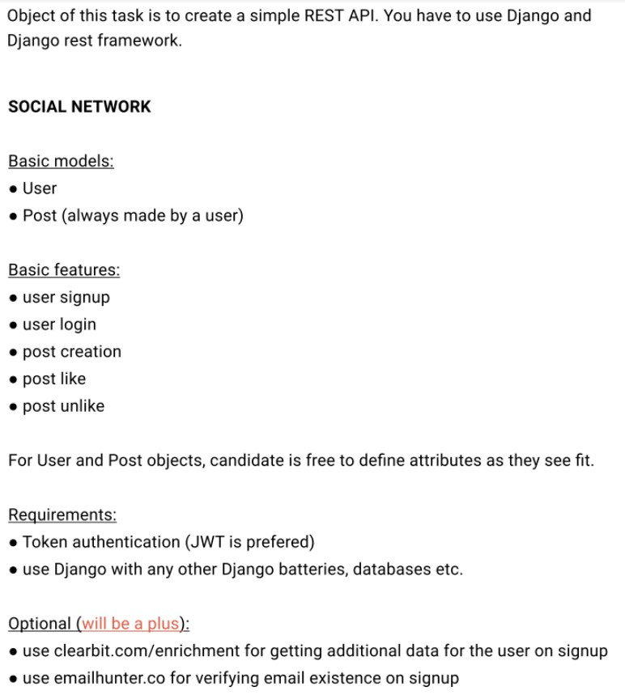

# WebtronicsTest
## Задача:

## Инструкция по запуску (Используется Docker):
Настроить в .env.dev переменные:  
HUNTER_IO_KEY - ключ для использования Email Verifier API Hunter.io  
CLEARBIT_API_KEY - ключ для использования Enrichment API Clearbit.com

Выполнить следующие комманды:  
1. Создайть образ и запустить контейнеры:  
docker-compose up -d --build  
2. Выполнить миграции:   
docker-compose exec web python manage.py migrate  
3. Создать супер-пользователя:  
docker-compose exec web python manage.py createsuperuser
